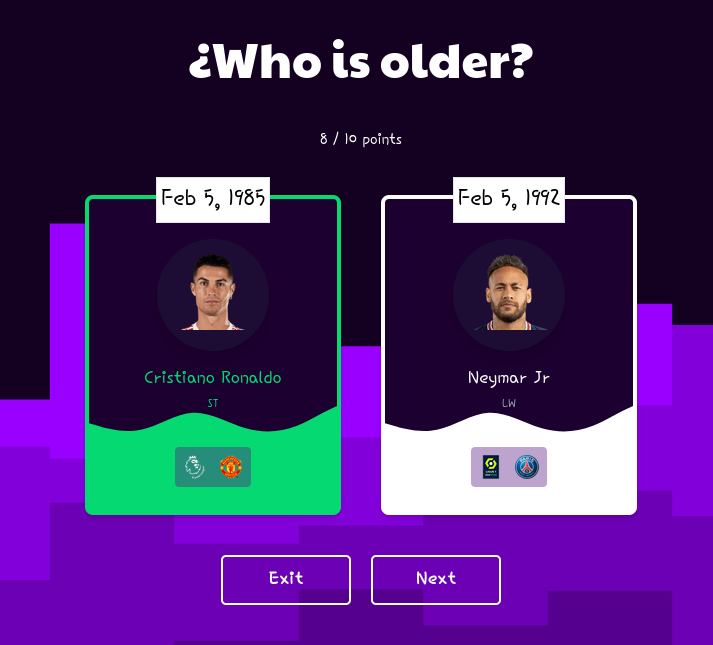

# Football Quiz



## Explanation

This project is a quiz where the user will prove their football knowledge. The app consumes a football API called **[FutDB](https://futdb.app/)**, that contains data information of FIFA 22 ULTIMATE TEAM. The way to win the game is by guessing the correct age of each soccer player.

## Demo

## Tech Stack


### Vite + React JS + Tailwind CSS

To create a React App, **Vite** was the best option.
This site was bult using [React JS](https://reactjs.org/) and [Tailwind CSS](https://tailwindcss.com/) for the frontend
In **ReactJS** , it was worked with functional components and useState Hook.
In addition, to animate UI, **[framer-motion](https://www.framer.com/motion/)** library was used.
Also, almost all jsx tags includes **Tailwind's** utilities classes.

## Docs

### Get data from FutDB API

#### Add the APIKEY

To get access to this API it was required to put the AUTH-TOKEN in the header of the request.

```javascript
const options = {
  headers: {
    'X-AUTH-TOKEN': import.meta.env.VITE_FUTDB_API_KEY
  }
}
```

#### Get all players

```http
GET https://futdb.app/api/players
```

| Parameter | Type      | Description      |
| :-------- | :-------- | :--------------- |
| `page`    | `integer` | **query**: page  |
| `limit`   | `integer` | **query**: limit |

The maximum number of players to be returned is 20.

#### Get player image

```http
GET https://futdb.app/api/players/${player}/image
```

| Parameter | Type      | Description                         |
| :-------- | :-------- | :---------------------------------- |
| `player`  | `integer` | **Required**. Id of player to fetch |

Return the image of the player

#### Get club image

```http
GET https://futdb.app/api/clubs/${club}/image
```

| Parameter | Type      | Description                       |
| :-------- | :-------- | :-------------------------------- |
| `club`    | `integer` | **Required**. Id of club to fetch |

Return the image of the club

#### Get league image

```http
GET https://futdb.app/api/leagues/${league}/image
```

| Parameter | Type      | Description                         |
| :-------- | :-------- | :---------------------------------- |
| `league`  | `integer` | **Required**. Id of league to fetch |

Return the image of the league

### Services

```javascript
const getPlayers = async (page) => {...}
```

Via axios, get the players of the specified page.
However, to avoid repetead players, a filter was implemented.

```javascript
{
  ...
    const { data: { items } } = await axios.get(URI, options)
    const filteredItems = items.filter((item) => item.rarity === rareRarity)
  ...
}
```

Another point is that the player object does not contain the image of the player, club and league so it was implemented another async function to get the images and add them to the object.

```javascript
const getImageFrom = async((param, id) => {...}
```

Where 'param' refers what image are getting (player, league, club),

## Deploy

The app was deployed on **[vercel](https://vercel.com/docs)**. Acces to the site [here](https://footbal-quiz.vercel.app)
